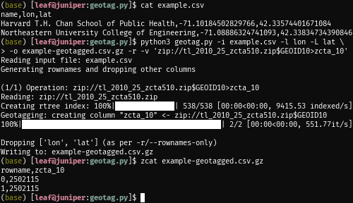

# geotag.py

Geocode flat CSV data using various shapefiles



### About

`geotag.py` implements the Geotagger class which can do very fast geotagging of big data in real time with live feedback through the use of R-tree spatial indices (via [rtree](https://toblerity.org/rtree/)) and [tqdm](https://tqdm.github.io/) (a progress bar library).

This functionality can be useful by allowing big data to be geotagged prior to the analysis process to create crosswalks that can then later be joined, rather than having to do a costly spatial join in the middle of the analysis process.

### Usage

`geotag.py` can be used either embedded in a script of as a command-line application.

For information on command-line usage, see `geotag.py --help`. An example can be seen below using the example data found in this repository:

```bash
$ python3 geotag.py \
>     --input example.csv \
>     --longitude lon \
>     --latitude lat \
>     --output example-geotagged.csv \
>     --rownames-only \
>     --verbose \
>     'zip://tl_2010_25_zcta510.zip$GEOID10>zcta_10'
Reading input file: example.csv
Generating rownames and dropping other columns

(1/1) Operation: zip://tl_2010_25_zcta510.zip$GEOID10>zcta_10
Reading: zip://tl_2010_25_zcta510.zip
Creating rtree index: 100%|███████████| 538/538 [00:00<00:00, 9753.82 indexed/s]
Geotagging: creating column "zcta_10" <- zip://tl_2010_25_zcta510.zip$GEOID10
100%|████████████████████████████████████████████| 2/2 [00:00<00:00, 640.30it/s]

Dropping ['lon', 'lat'] (as per -r/--rownames-only)
Writing to: example-geotagged.csv
```

Embedding `geotag.py` is also straightforward:

```python
>>> import pandas, geotag, geopandas
>>> df = pandas.read_csv("example.csv")
>>> gdf = geopandas.read_file("zip://tl_2010_25_zcta510.zip")
>>> tagger = Geotagger(gdf, "GEOID10")
>>> df["zcta_10"] = df[["lon", "lat"]].apply(
...     lambda xy: tagger.lookup(*xy), axis = 1
... )
>>> df.to_csv("example-geotagged.csv", index=False)
```

### Future directions

The routines in the Geotagger object could theoretically be parallelized through a MapReduce-like programming pattern for faster geotagging, but the memory usage would increase proportinally with the number of cores being used. For this reason, parallelization has not yet been implemented.

In the future, the current libraries may also be replaced with more performant alternatives, or CPU-intensive parts reimplemented in a faster language like C++.

Contributions welcome!